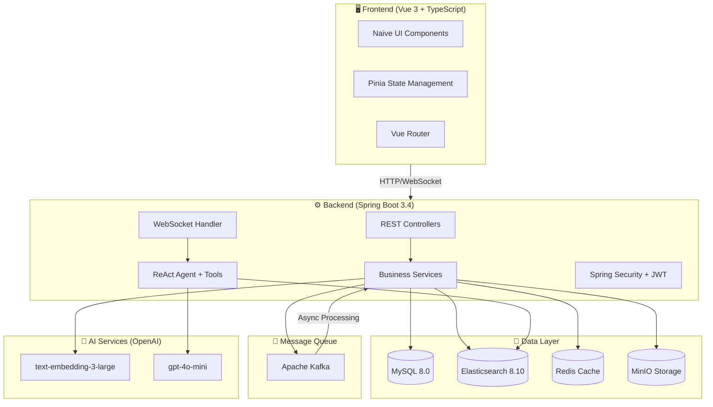
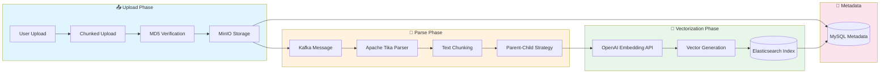
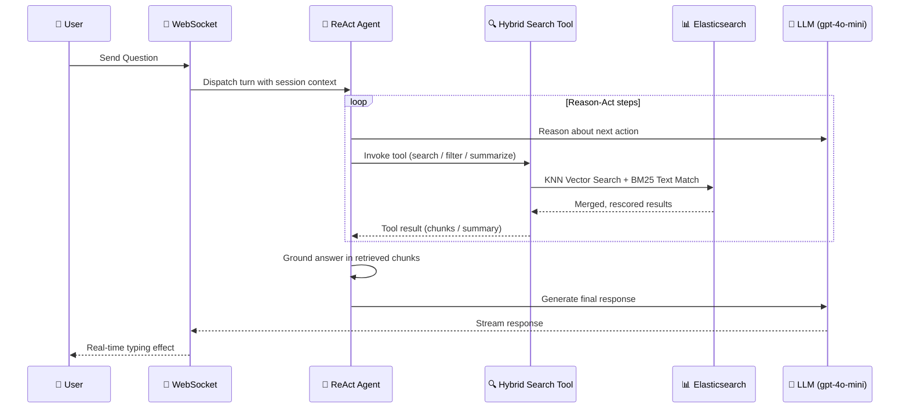
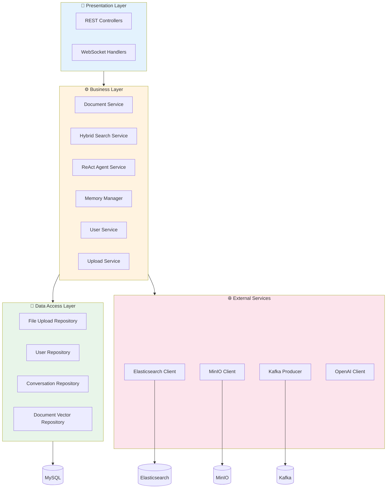

# RoboKnow

<p align="center">
  <strong>🚀 Enterprise-grade RAG + Agent Knowledge Base System</strong>
</p>

<p align="center">
  
  
  
  
  
</p>

---

## 📖 Introduction

This is a personal learning project for deeply studying and practicing RAG (Retrieval-Augmented Generation), agentic tool-calling, and enterprise-level system development.

RoboKnow is an enterprise-grade AI knowledge base system that combines Retrieval-Augmented Generation with a ReAct-style agent, hybrid search, and layered conversation memory. It supports multi-tenant architecture, letting users query a knowledge base in natural language and receive AI-generated, document-grounded responses through a persistent, resumable chat session.

### System Architecture



The system allows users to:

- Upload and manage various types of documents
- Automatically process, chunk, and index document content
- Query the knowledge base using natural language over a persistent chat session
- Receive AI-generated responses grounded in retrieved document chunks, with citations

## 🛠️ Technology Stack

### Backend Technologies

| Category | Technology |
|----------|------------|
| Framework | Spring Boot 3.4.2 (Java 17) |
| Database | MySQL 8.0 |
| ORM | Spring Data JPA |
| Cache | Redis |
| Search Engine | Elasticsearch 8.10.0 |
| Message Queue | Apache Kafka |
| File Storage | MinIO |
| Document Parsing | Apache Tika |
| Security | Spring Security + JWT |
| AI Integration | OpenAI API (gpt-4o-mini chat + text-embedding-3-large embeddings) |
| Agent | ReAct-style tool-calling agent (hybrid search, metadata filter, summarization tools) |
| Real-time Communication | WebSocket |
| Dependency Management | Maven |
| Reactive Programming | WebFlux |

### Frontend Technologies

| Category | Technology |
|----------|------------|
| Framework | Vue 3 + TypeScript |
| Build Tool | Vite |
| UI Components | Naive UI |
| State Management | Pinia |
| Routing | Vue Router |
| Styling | UnoCSS + SCSS |
| Icons | Iconify |
| Package Manager | pnpm |

## 📁 Project Structure

### Backend Structure

```bash
src/main/java/com/yizhaoqi/roboknow/
├── RoboKnowApplication.java      # Main application entry
├── agent/                        # ReAct agent (state, steps, tools)
│   └── tool/                     # Agent tools: hybrid search, metadata filter, summarization
├── client/                       # External API clients (OpenAI chat/embedding)
├── config/                       # Configuration classes (Security, WebClient, etc.)
├── consumer/                     # Kafka consumers
├── controller/                   # REST API endpoints
├── entity/                       # Search/document DTOs (ES doc, chunk, search req/result)
├── exception/                    # Custom exceptions
├── handler/                      # WebSocket handlers
├── memory/                       # Conversation memory (short/long-term, compression, token budget)
├── model/                        # JPA entities (User, FileUpload, ConversationSession, etc.)
├── repository/                   # Data access layer
├── service/                      # Business logic
└── utils/                        # Utility classes
```

### Frontend Structure

```bash
frontend/
├── packages/           # Reusable modules
├── public/             # Static assets
├── src/
│   ├── assets/         # SVG icons, images
│   ├── components/     # Vue components
│   ├── constants/      # Shared constants
│   ├── enum/           # Enum definitions
│   ├── hooks/          # Composables
│   ├── layouts/        # Page layouts
│   ├── locales/        # i18n resources
│   ├── plugins/        # Vue plugin setup
│   ├── router/         # Route configuration
│   ├── service/        # API integration
│   ├── store/          # Pinia state management
│   ├── styles/         # Global styles
│   ├── theme/          # Theme configuration
│   ├── typings/        # TypeScript type declarations
│   ├── utils/          # Utility functions
│   └── views/          # Page components
└── ...                 # Build configuration files
```

## 🎯 Core Features

### 📚 Knowledge Base Management

RoboKnow provides complete document upload and parsing, supporting chunked file uploads and resumable transfers, with tag-based organization management. Documents can be public or private and associated with organization tags for permission scoping.

#### Document Processing Pipeline



### 🧠 Agentic RAG

The core of RoboKnow is a ReAct-style agent that decides when to search, filter, and summarize instead of a single fixed retrieval pass:

#### RAG Chat Flow



- Semantic chunking of uploaded documents (parent-child strategy)
- OpenAI `text-embedding-3-large` embeddings for each chunk
- Vectors stored in Elasticsearch, combined with BM25 for hybrid recall
- Agent tools (`HybridSearchTool`, `MetadataFilterTool`, `SummarizationTool`) let the model decide what to retrieve and when
- Conversation memory (short-term session context + long-term user facts, with token-budget-aware compression) keeps multi-turn chats grounded without blowing the context window

### 🏢 Enterprise Multi-tenancy

RoboKnow supports multi-tenant architecture through organization tags. Each user can create or join one or more organizations, each with independent knowledge bases and document management, so multiple teams can share the same deployment without data or permission bleed-through.

### 💬 Real-time, Persistent Conversations

The system uses WebSocket for real-time chat, with conversation turns persisted server-side (commit-then-push) so sessions survive reconnects and can be resumed, listed, and switched between via the conversation API.

## 📋 Prerequisites

Before getting started, please ensure the following software is installed:

- Java 17
- Maven 3.8.6 or higher
- Node.js 18.20.0 or higher
- pnpm 8.7.0 or higher
- MySQL 8.0
- Elasticsearch 8.10.0
- MinIO 8.5.12
- Kafka 3.2.1
- Redis 7.0.11
- Docker (optional, for running Redis, MinIO, Elasticsearch, and Kafka services)
- An OpenAI API key (chat completions + embeddings)

## 🏗️ Architecture Design

### Layered Architecture



### Key REST Endpoints

| Area | Base Path | Examples |
|------|-----------|----------|
| Auth | `/api/v1/auth` | refresh token |
| Users | `/api/v1/users` | register, login, `me`, org tags, logout |
| Documents | `/api/v1/documents` | delete, accessible list, uploads, download, preview, stream |
| Upload | `/api/v1/upload` | chunked upload, status, merge, supported types |
| Search | `/api/v1/search` | `/hybrid` |
| Chat | `/api/v1/chat` | websocket token issuance |
| Conversation | `/api/v1/users/conversation` | list, sessions, switch, delete |
| Admin | `/api/v1/admin` | users, org tags, knowledge base, system status |
| AI Usage | `/api/v1/ai/usage` | token usage reporting |

## 🚀 Quick Start

### Backend Setup

```bash
# Clone the project
git clone git@github.com:Automan1218/RoboKnow.git

# Navigate to project directory
cd RoboKnow

# Start dependency services (MySQL, Redis, MinIO, Elasticsearch, Kafka)
docker-compose -f docs/docker-compose.yaml up -d

# Set required environment variables (JWT secret, OpenAI key, DB credentials, ...)
# then build and run
mvn spring-boot:run
```

### Frontend Setup

```bash
# Navigate to frontend directory
cd frontend

# Install dependencies
pnpm install

# Start the project
pnpm run dev
```

## 📄 License

This project is for learning purposes only.

## ⭐ Show Your Support

Give a ⭐️ if this project helped you!
