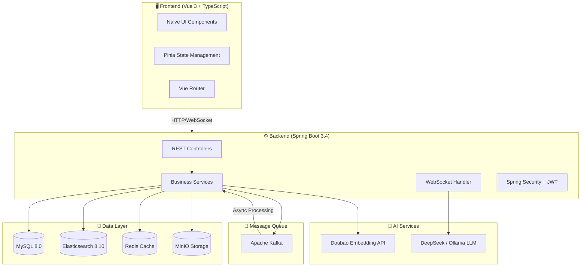
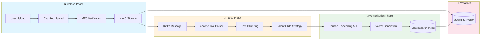
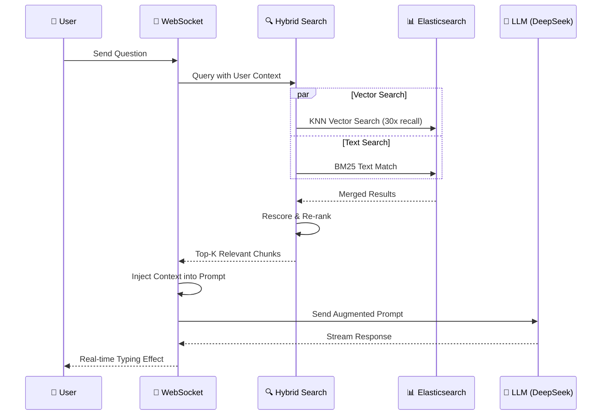
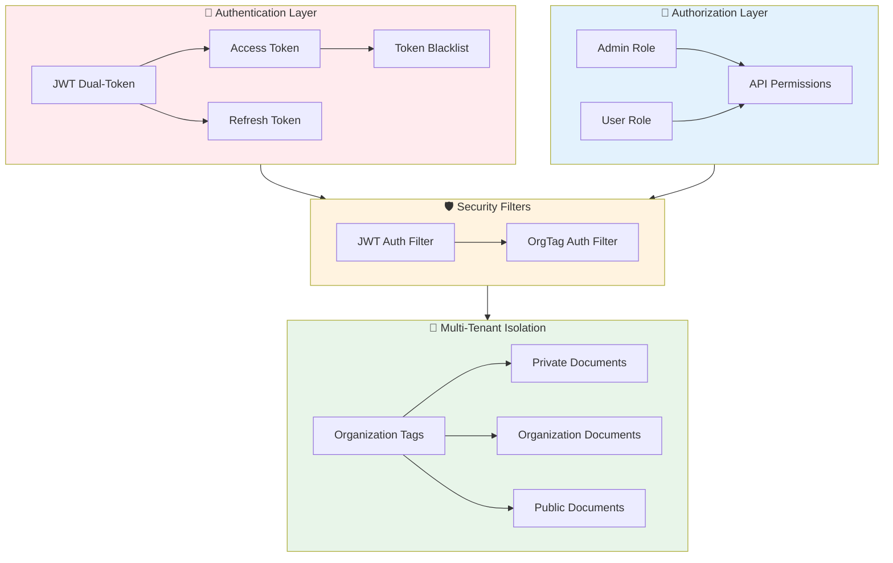
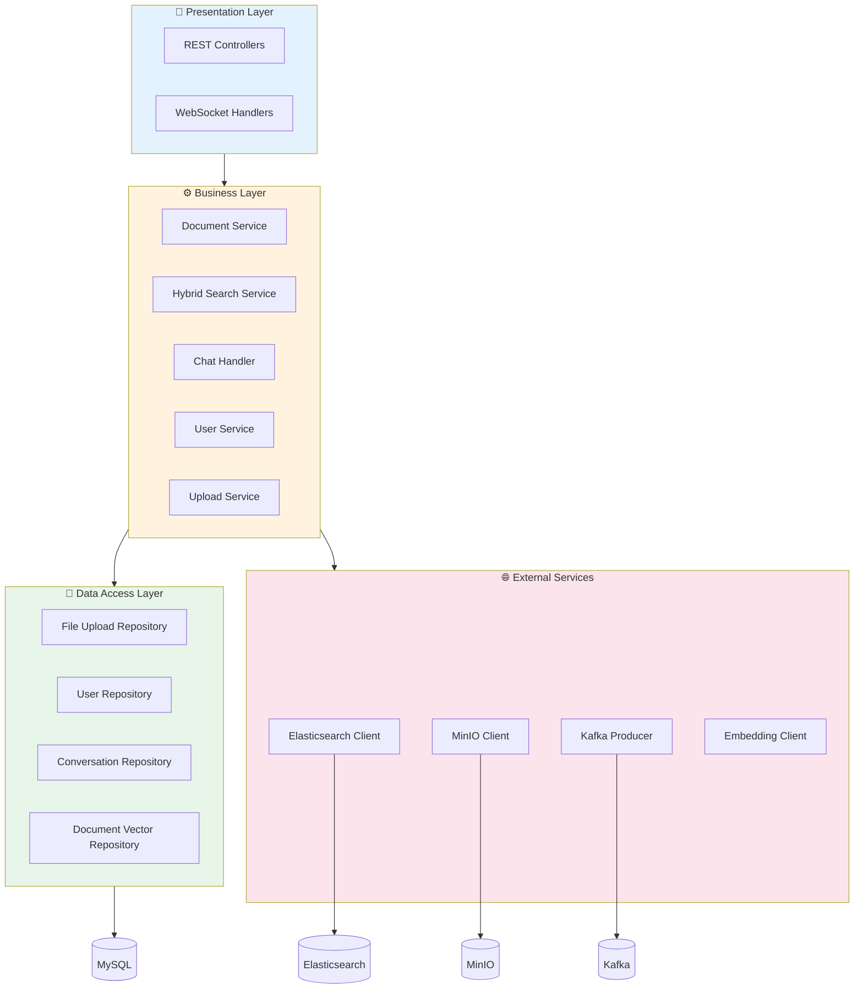

# RoboKnow

<p align="center">
  <strong>🚀 Enterprise-grade RAG Intelligent Knowledge Base System</strong>
</p>

<p align="center">
  <a href="./README.md">English</a> | <a href="./README_CN.md">简体中文</a>
</p>

<p align="center">
  
  
  
  
  
</p>

---

## 📖 Introduction

This is my **personal learning project**, aimed at deeply studying and practicing RAG (Retrieval-Augmented Generation) technology, microservices architecture, and enterprise-level system development.

RoboKnow is an enterprise-grade AI knowledge base management system that leverages Retrieval-Augmented Generation (RAG) technology to provide intelligent document processing and retrieval capabilities.

The core technology stack includes ElasticSearch, Kafka, WebSocket, Spring Security, Docker, MySQL, and Redis.

Its goal is to help enterprises and individuals manage and utilize information in knowledge bases more efficiently. It supports multi-tenant architecture, allows users to query the knowledge base using natural language, and receive AI-generated responses based on their own documents.

### System Architecture



The system allows users to:

- Upload and manage various types of documents
- Automatically process and index document content
- Query the knowledge base using natural language
- Receive AI-generated responses based on their own documents

## 🛠️ Technology Stack

### Backend Technologies

| Category | Technology |
|----------|------------|
| Framework | Spring Boot 3.4.2 (Java 17) |
| Database | MySQL 8.0 |
| ORM | Spring Data JPA |
| Cache | Redis |
| Search Engine | Elasticsearch 8.10.0 |
| Message Queue | Apache Kafka |
| File Storage | MinIO |
| Document Parsing | Apache Tika |
| Security | Spring Security + JWT |
| AI Integration | DeepSeek API / Local Ollama + Doubao Embedding |
| Real-time Communication | WebSocket |
| Dependency Management | Maven |
| Reactive Programming | WebFlux |

### Frontend Technologies

| Category | Technology |
|----------|------------|
| Framework | Vue 3 + TypeScript |
| Build Tool | Vite |
| UI Components | Naive UI |
| State Management | Pinia |
| Routing | Vue Router |
| Styling | UnoCSS + SCSS |
| Icons | Iconify |
| Package Manager | pnpm |

## 📁 Project Structure

### Backend Structure

```bash
src/main/java/com/yizhaoqi/smartpai/
├── SmartPaiApplication.java      # Main application entry
├── client/                       # External API clients
├── config/                       # Configuration classes
├── consumer/                     # Kafka consumers
├── controller/                   # REST API endpoints
├── entity/                       # Data entities
├── exception/                    # Custom exceptions
├── handler/                      # WebSocket handlers
├── model/                        # Domain models
├── repository/                   # Data access layer
├── service/                      # Business logic
└── utils/                        # Utility classes
```

### Frontend Structure

```bash
frontend/
├── packages/           # Reusable modules
├── public/             # Static assets
├── src/                # Main application code
│   ├── assets/         # SVG icons, images
│   ├── components/     # Vue components
│   ├── layouts/        # Page layouts
│   ├── router/         # Route configuration
│   ├── service/        # API integration
│   ├── store/          # State management
│   ├── views/          # Page components
│   └── ...            # Other utilities and configs
└── ...               # Build configuration files
```

## 🎯 Core Features

### 📚 Knowledge Base Management

RoboKnow provides complete document upload and parsing functionality, supporting chunked file uploads and resumable transfers, with tag-based organization management. Documents can be public or private and can be associated with specific organization tags for better permission classification.

#### Document Processing Pipeline



### 🧠 AI-Driven RAG Implementation

The core of RoboKnow is the RAG implementation:

#### RAG Chat Flow



- Semantic chunking of uploaded documents
- Calling Doubao Embedding model to generate high-dimensional vectors for each text chunk
- Storing vectors in ElasticSearch to support semantic search and keyword search
- Retrieving relevant documents based on user queries
- Providing complete context to LLM to generate more accurate, document-based responses

### 🏢 Enterprise Multi-tenancy

RoboKnow supports multi-tenant architecture through organization tags. Each user can create or join one or more organizations, and each organization can have independent knowledge bases and document management.

#### Security & Access Control Architecture



This allows enterprises to manage knowledge bases for multiple teams or departments within the same system without worrying about data confusion or permission issues.

### 💬 Real-time Communication

The system uses WebSocket technology to provide real-time interaction between users and the AI system, supporting responsive chat interfaces for knowledge retrieval and AI interaction.

## 📋 Prerequisites

Before getting started, please ensure the following software is installed:

- Java 17
- Maven 3.8.6 or higher
- Node.js 18.20.0 or higher
- pnpm 8.7.0 or higher
- MySQL 8.0
- Elasticsearch 8.10.0
- MinIO 8.5.12
- Kafka 3.2.1
- Redis 7.0.11
- Docker (optional, for running Redis, MinIO, Elasticsearch, and Kafka services)

## 🏗️ Architecture Design

RoboKnow's architecture features a modern, cloud-native application with clear separation of concerns, scalable components, and integration with AI technology. The modular design allows for future expansion and replacement of individual components as technology evolves, especially in the rapidly changing field of AI integration.

### Layered Architecture



### Controller Layer

Handles HTTP requests, validates input, manages request/response formatting, and delegates business logic to the service layer. Controllers are organized by domain functionality. Following RESTful design principles, with integrated performance monitoring and logging for tracking API usage and troubleshooting.

```java
@RestController
@RequestMapping("/api/v1/documents")
public class DocumentController {
    @Autowired
    private DocumentService documentService;
    
    @DeleteMapping("/{fileMd5}")
    public ResponseEntity<?> deleteDocument(
            @PathVariable String fileMd5,
            @RequestAttribute("userId") String userId,
            @RequestAttribute("role") String role) {
        // Parameter validation and delegation to service
        documentService.deleteDocument(fileMd5);
        // Response handling
    }
}
```

### Service Layer

Primarily handles application business logic, with transaction awareness and the ability to handle operations across multiple data sources.

```java
@Service
public class DocumentService {
    @Autowired
    private FileUploadRepository fileUploadRepository;
    
    @Autowired
    private MinioClient minioClient;
    
    @Autowired
    private ElasticsearchService elasticsearchService;
    
    @Transactional
    public void deleteDocument(String fileMd5) {
        // Business logic for document deletion
        // Coordinating multiple repositories and systems
    }
}
```

### Data Access Layer

Uses Spring Data JPA for database operations, providing CRUD operations for MySQL.

```java
@Repository
public interface FileUploadRepository extends JpaRepository<FileUpload, Long> {
    Optional<FileUpload> findByFileMd5(String fileMd5);
    
    @Query("SELECT f FROM FileUpload f WHERE f.userId = :userId OR f.isPublic = true OR (f.orgTag IN :orgTagList AND f.isPublic = false)")
    List<FileUpload> findAccessibleFilesWithTags(@Param("userId") String userId, @Param("orgTagList") List<String> orgTagList);
}
```

### Entity Layer

Consists of JPA entities mapped to database tables and DTOs (Data Transfer Objects) for API requests and responses.

```java
@Entity
public class FileUpload {
    @Id
    @GeneratedValue(strategy = GenerationType.IDENTITY)
    private Long id;
    
    private String fileMd5;
    private String fileName;
    private String userId;
    private boolean isPublic;
    private String orgTag;
    // Other fields and methods
}
```

## 🚀 Quick Start

### Backend Setup

```bash
# Clone the project
git clone https://github.com/your-username/roboknow.git

# Navigate to backend directory
cd roboknow

# Start dependency services (Docker Compose)
docker-compose up -d

# Build and run
mvn spring-boot:run
```

### Frontend Setup

```bash
# Navigate to frontend directory
cd frontend

# Install dependencies
pnpm install

# Start the project
pnpm run dev
```

## 📄 License

This project is for learning purposes only.

## ⭐ Show Your Support

Give a ⭐️ if this project helped you!
